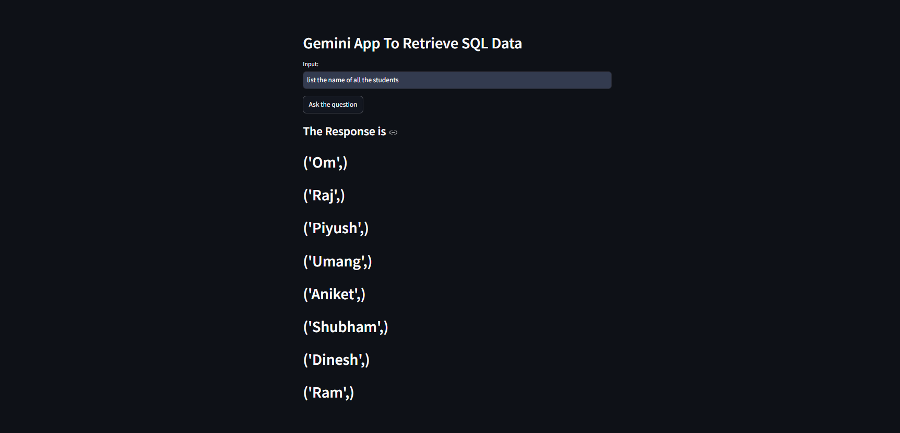

# SQLGenie

SQLGenie is a Streamlit application designed to convert natural language questions into SQL queries. It utilizes the Google Gemini model to interpret user inputs and retrieve data from a SQLite database. The project showcases how to integrate natural language processing with database operations to create an interactive user experience.

## Features

- **Natural Language Processing**: Converts English questions to SQL queries.
- **SQLite Database**: Uses a local SQLite database (`student.db`) to store student information.
- **Streamlit Interface**: A user-friendly web interface to interact with the application.
- **Dynamic Query Generation**: Generates SQL commands based on user input.

## Installation

1. Clone the repository:

   ```bash
   git clone https://github.com/Om-Shankar-Thakur/SQLGenie.git
   cd SQLGenie

2. Set up a virtual environment and install dependencies:

   ```bash
   python -m venv myenv
   source myenv/bin/activate  # On Windows use: myenv\Scripts\activate
   pip install -r requirements.txt

3. Create a .env file to store your Google API key:
   ```bash
   GOOGLE_API_KEY=your_api_key_here

4. Start the Streamlit app:
   ```bash
   streamlit run app.py

## OR

5. Open your browser and go to:
   ```bash
   http://localhost:8501 to use the application.


## Database Structure

The SQLite database (student.db) has a table named STUDENT1 with the following columns:
      ```bash

      NAME: Name of the student
      CLASS: Class of the student
      SECTION: Section of the student
      MARKS: Marks obtained by the student

## Output:

